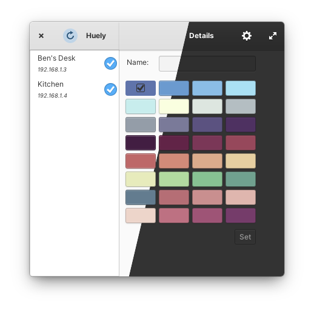

# Huely

Control WiFi lights using this simple app.

## System requirements

  - [elementary OS](https://elementary.io) 6.1 (Jólnir)

## Hardware requirements

This app is intended to control WiFi connected lights that are compatible with the [Android Magic Home app](https://play.google.com/store/apps/details?id=com.Zengge.LEDWifiMagicHome). Additional light types will most likely be added in the future, but for now this is the initial target light type.

## Developer notes

### Getting started

Clone this repository and run the install task:
### About

This project is written in [Vala](https://valadoc.org/) 

### Tasks

#### Install

Configures and runs the build, installs settings-related features and translations and refreshes the icon cache.

Run this after you clone this repository to get a working build.

#### Build

Builds the project.

#### Run

Builds and runs the executable.

## Continuous integration
[Continuous Integration](https://docs.elementary.io/develop/writing-apps/our-first-app/continuous-integration) is set up for this repository.

## Copyright and license

Copyright &copy; 2022-present Ben Foote

Licensed under [GNU GPL version 3.0](./LICENSE).
