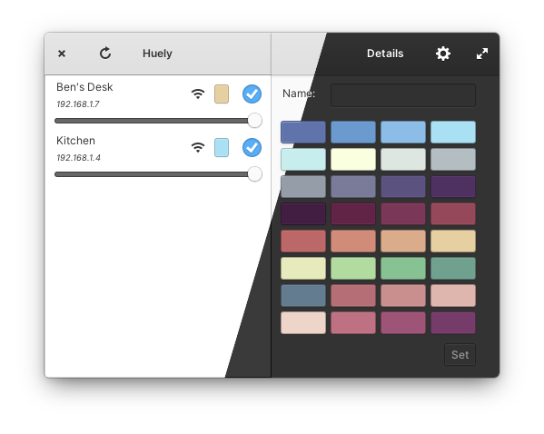

# Huely


Control WiFi lights using this simple app.



<a href="https://www.flathub.org/apps/details/com.github.benpocalypse.Huely">

</a>

## Hardware requirements

This app is intended to control WiFi connected lights that are compatible with the [Android Magic Home app](https://play.google.com/store/apps/details?id=com.Zengge.LEDWifiMagicHome). Additional light types will most likely be added in the future, but for now this is the initial target light type.

## Developer notes

### Getting started

Clone this repository and run the install task:

```shell
task/install
```

You can now run the app from either the _Applications Menu_ or using the run task:

```shell
task/run
```

### About

This project is written in [Vala](https://valadoc.org/) and follows the following elementary OS guidelines:

  - [Human Interface Guidelines](https://docs.elementary.io/hig/)
  - [Developer Guidelines](https://docs.elementary.io/develop/)
  - [Coding style](https://docs.elementary.io/develop/writing-apps/code-style)

Please take some time to familiarize yourself with those documents before continuing.

To get your system ready to develop for elementary OS, please see the [Basic Setup](https://docs.elementary.io/develop/writing-apps/the-basic-setup) section of the [elementary OS Developer Documentation](https://docs.elementary.io/develop/).

### Tasks

#### Install

Configures and runs the build, installs settings-related features and translations and refreshes the icon cache.

Run this after you clone this repository to get a working build.

```shell
task/install
```

#### Build

Builds the project.

```shell
task/build
```

#### Run

Builds and runs the executable.

```shell
task/run
```

#### Package

Creates a Flatpak package.

```shell
task/package
```

#### Run Package

Creates and runs a Flatpak package.

```shell
task/run-package
```

#### Take screenshots

Takes screenshots of your app in both the light and dark colour schemes and also creates a montage of the two for use in the AppCenter.

For ideas on how to customise this script for more complicated screenshots, see [the take-screenshots script for Comet](https://github.com/small-tech/comet/blob/main/task/take-screenshots).

```shell
task/take-screenshots
```

> You must push the generated screenshots folder to your GitHub repository before the screenshot will appear when you preview your app in AppCenter.

#### Preview in AppCenter

Launches app locally in AppCenter so you can preview how it will look when published.

Optionally, you can specify a language code (e.g., `tr_TR`) to preview a specific localisation.

```shell
task/preview-in-appcenter <language-code>
```

## It’s elementary, my dear…

This project was initially generated by [Watson](https://github.com/small-tech/watson), a tool for quickly setting up a new elementary OS 6 app that follows platform [human interface](https://docs.elementary.io/hig/) and [development](https://docs.elementary.io/develop/) guidelines.

## Copyright and license

Copyright &copy; 2022-present Ben Foote

Licensed under [GNU GPL version 3.0](./LICENSE).
